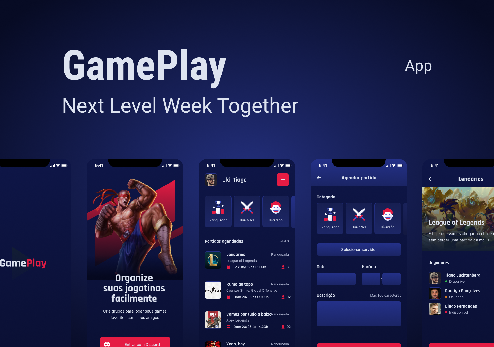

<h1 align="center">
  
</h1>

 

  

## ✨ Tecnologias

Esse projeto foi desenvolvido com as seguintes tecnologias:

- [React Native](https://reactnative.dev/)
- [Typescript](https://www.typescriptlang.org/)
- [Expo](https://expo.io/)

## 💻 Projeto

Aplicativo para lhe ajudar a organizar suas jogatinas facilmente. Agende partidas, crie grupos e convide seus amigos.

## 🔖 Layout

Você pode visualizar o layout do projeto através [desse link](https://www.figma.com/file/9XmRxEqEFyn7V11yu5Au1q/GamePlay?node-id=50494%3A242). É necessário ter conta no [Figma](http://figma.com/) para acessá-lo.

## 🚀 Como executar

- Clone o repositório
- Instale as dependências com `yarn`
- Inicie seu app com `expo start`

## 📄 Licença

Esse projeto está sob a licença MIT. Veja o arquivo [LICENSE](LICENSE.md) para mais detalhes.

---